# CycloneSense — Explainable Multi-Source Tropical Cyclone Pattern Intelligence

[](https://fastapi.tiangolo.com)
[](https://nextjs.org)
[](https://pytorch.org)
[](https://python.org)
[]()
[]()
[](https://opensource.org/licenses/MIT)

> **CycloneSense** is an authentic, explainable meteorological intelligence platform designed to ingest, quality-control, and analyze tropical cyclone patterns directly from scientific Earth Observation (EO) satellite products (NetCDF4, HDF5).

CycloneSense operates on a strict **zero-mock-data integrity** principle: all telemetry, satellite tensors, and model predictions originate directly from genuine Earth observation data feeds (NOAA GOES-16 on AWS S3, NASA Earthdata CMR, and NOAA IBTrACS best-track archives) without fabricated values, simulated predictions, or synthetic dashboard placeholders.

---

## Team

This prototype was built by:

### Koushik Katkam
- Email: [koushikkatkam@gmail.com](mailto:koushikkatkam@gmail.com)
- GitHub: [https://github.com/KatkamKoushik](https://github.com/KatkamKoushik)
- LinkedIn: [https://linkedin.com/in/koushik-katkam](https://linkedin.com/in/koushik-katkam)
- Instagram: [https://instagram.com/koushik_katkam](https://instagram.com/koushik_katkam)

### Varshini Akula
- Email: [varshiniakula6@gmail.com](mailto:varshiniakula6@gmail.com)
- GitHub: [https://github.com/varshini-devops](https://github.com/varshini-devops)
- LinkedIn: [https://www.linkedin.com/in/varshini-akula-1a52b0380/](https://www.linkedin.com/in/varshini-akula-1a52b0380/)

### Nivedan Katkam
- Email: [nivedankatkam@gmail.com](mailto:nivedankatkam@gmail.com)
- GitHub: [https://github.com/nivedankatkam](https://github.com/nivedankatkam)
- LinkedIn: [https://www.linkedin.com/in/katkam-nivedan-442376272/](https://www.linkedin.com/in/katkam-nivedan-442376272/)

---

## System Architecture

```mermaid
flowchart LR
    subgraph DataSources["Authentic Satellite & Best-Track Sources"]
        GOES["NOAA GOES-16/18 ABI (AWS S3 Open Data)"]
        NASA["NASA Earthdata CMR / Cloud Granules"]
        IBTrACS["NOAA NCEI IBTrACS Archive (v04r01 NetCDF)"]
    end

    subgraph ScientificCore["Scientific Core & QC Engine"]
        Reader["ScientificReader (Native NetCDF4 & HDF5)"]
        QC["QualityControlEngine (Physical Bounds & DQF)"]
        Prov["ProvenanceTracker (W3C PROV & SHA-256)"]
    end

    subgraph MLPipeline["ML & Explainability Engine (PyTorch)"]
        Tensor["Tensor Builder (2-Channel IR/WV & 8 Covariates)"]
        Fusion["Multimodal Fusion Model (CNN + MLP)"]
        ImageOnly["Image-Only CNN Encoder"]
        EnvOnly["Environment-Only MLP"]
        CLIPER["Analytical CLIPER Baseline (Ridge)"]
        GradCAM["Grad-CAM Saliency & Core Ratio"]
    end

    subgraph BackendAPI["Backend REST API (FastAPI)"]
        Endpoints["FastAPI Layer (/ingest, /storms, /ml, /provenance)"]
        DB[(SQLite / SQLAlchemy 2.0 Async)]
    end

    subgraph Frontend["Interactive Web Application (Next.js 16)"]
        Dashboard["Operational Dashboard"]
        Studio["Analysis Studio (Direct Granule / Track)"]
        Viewer["Scientific NetCDF Matrix Viewer"]
        Explorer["Storm Track Trajectory Explorer"]
        XAI["Explainability Diagnostic Lab"]
        Ledger["W3C PROV Lineage Ledger"]
    end

    DataSources --> Reader
    Reader --> QC
    QC --> Prov
    QC --> Tensor
    Tensor --> Fusion & ImageOnly & EnvOnly & CLIPER
    Fusion --> GradCAM
    ImageOnly --> GradCAM
    Fusion & ImageOnly & EnvOnly & CLIPER & GradCAM --> Endpoints
    Prov --> Endpoints
    Endpoints <--> DB
    Endpoints <--> Frontend
```



For the formal architecture specification, empirical benchmark comparisons, and delivery roadmap for the SANKALP evaluation, see [Final Technology Stack & Technical Approach](file:///d:/CycloneSense/docs/architecture/FINAL_TECHNOLOGY_STACK_AND_TECHNICAL_APPROACH.md).

---

## Key Technical Features

- **Direct Scientific Container Ingestion:** Directly inspects and extracts arrays from native **NetCDF4** and **HDF5** containers using `netCDF4`, `h5py`, and `xarray`. Satellite observations are never converted to lossy 8-bit image formats (PNG/JPEG) as a canonical representation.
- **Real-Time Satellite Data Stream Adapters:**
  - **NOAA GOES-16/18:** Streams public ABI-L2-CMIPC (Cloud & Moisture Imagery) NetCDF granules directly from NOAA's open AWS S3 bucket (`noaa-goes16.s3.amazonaws.com`).
  - **NASA Earthdata CMR:** Live search and metadata discovery via NASA's Common Metadata Repository using token authentication.
  - **NOAA NCEI IBTrACS:** Ingests official best-track historical archives (`IBTrACS.NI.v04r01.nc`) containing storm trajectories, minimum pressures, and wind speeds.
- **Physical Quality Control Gating:** Automated pre-inference screening:
  - Validates Brightness Temperatures within canonical physical boundaries ($175\ \text{K} \le T_B \le 320\ \text{K}$).
  - Validates atmospheric central pressures ($850\ \text{hPa} \le P \le 1050\ \text{hPa}$).
  - Gating checks for excessive missing/fill pixels and Data Quality Flag (DQF) masks.
- **Multimodal Neural Architectures:**
  - **Multimodal Fusion:** Concatenates 2-channel CNN latent vectors ($D=128$) with LayerNorm environment embeddings ($D=64$).
  - **Image-Only CNN:** Multi-scale convolutional network consuming $10.35\ \mu\text{m}$ Clean Infrared and $6.2\ \mu\text{m}$ Water Vapor fields.
  - **Environment-Only MLP:** LayerNorm MLP consuming 8 atmospheric and kinematic covariates (latitude/Coriolis, pressure deficit, translation speed, azimuth, and seasonal harmonics).
  - **Analytical CLIPER Baseline:** Closed-form regularized Ridge regression physical Climatology & Persistence baseline.
- **Physical Explainability (Grad-CAM & Core Concentration):**
  - Extracts gradient-weighted feature activation heatmaps to isolate convective eyewall structures from peripheral clouds.
  - Computes the **Eyewall Core Concentration Ratio ($R_{\text{core}}$)** to quantify whether model attention is physically concentrated on the cyclone inner core.
  - Provides normalized input-gradient feature attribution rankings across all 8 environmental covariates.
- **Immutable W3C PROV Cryptographic Lineage:** Every ingested file, intermediate tensor, and model prediction produces an immutable SHA-256 digest tracked in a W3C PROV-compliant lineage ledger.

---

## Repository Structure

```
CycloneSense/
├── backend/
│   ├── app/
│   │   ├── main.py                     # FastAPI application entry & CORS configuration
│   │   ├── config.py                   # Central settings, paths, and environment bindings
│   │   ├── api/                        # REST API endpoint routers
│   │   │   ├── routes_ingest.py        # Real-time search, streaming fetch, NetCDF inspection
│   │   │   ├── routes_storms.py        # IBTrACS storm catalog and trajectory endpoints
│   │   │   ├── routes_ml.py            # Neural inference jobs, Grad-CAM, direct granule feed
│   │   │   ├── routes_provenance.py    # Lineage audit trails and SHA-256 verification
│   │   │   └── routes_system.py        # Adapter health checks, settings, GPU diagnostics
│   │   ├── adapters/                   # Satellite data acquisition adapters
│   │   │   ├── base.py                 # Abstract BaseSatelliteAdapter interface
│   │   │   ├── goes.py                 # NOAA GOES-16/18 AWS S3 REST adapter
│   │   │   ├── nasa.py                 # NASA Earthdata CMR token-auth adapter
│   │   │   ├── ibtracs.py              # NOAA NCEI IBTrACS archive adapter
│   │   │   └── insat.py                # ISRO MOSDAC INSAT-3D/3DR adapter
│   │   ├── scientific/                 # Scientific data engines
│   │   │   ├── reader.py               # Native NetCDF4/HDF5 reader & CF attribute extractor
│   │   │   ├── qc.py                   # QualityControlEngine & physical sanity gates
│   │   │   ├── provenance.py           # Cryptographic SHA-256 hashing & W3C PROV records
│   │   │   ├── storm_extractor.py      # Spatial radius-based cyclone window cropping
│   │   │   └── grid_product_generator.py# CF-1.8 reference satellite generator
│   │   ├── ml/                         # Machine learning & neural networks
│   │   │   ├── models/                 # PyTorch models (Fusion, Image CNN, Env MLP, CLIPER)
│   │   │   ├── dataset.py              # IBTrACS dataset builder & leakage prevention
│   │   │   ├── evaluation.py           # Meteorological error metrics (MAE, RMSE, Bias, Macro-F1)
│   │   │   ├── explainability.py       # Grad-CAM explainer & environmental attribution
│   │   │   └── temporal.py             # Multi-timestamp kinematic & thermodynamic comparator
│   │   ├── db/                         # SQLAlchemy 2.0 async database models and session
│   │   └── workers/                    # Task queue & Celery configuration
│   └── tests/                          # 40-test automated verification suite
│
├── frontend/                           # Next.js 16 (App Router) + TypeScript + Tailwind CSS
│   ├── src/
│   │   ├── app/                        # Application pages
│   │   │   ├── page.tsx                # Operational Executive Dashboard
│   │   │   ├── analysis/               # Multimodal Neural Inference Studio
│   │   │   ├── data-viewer/            # High-resolution NetCDF/HDF5 matrix viewer
│   │   │   ├── explorer/               # Historical storm catalog and trajectory explorer
│   │   │   ├── explainability/         # Convective saliency and attribution diagnostic lab
│   │   │   ├── models/                 # Model registry and benchmark evaluation report
│   │   │   ├── provenance/             # Immutable W3C PROV cryptographic lineage ledger
│   │   │   ├── results/                # Complete job report, saliency, and diagnostics
│   │   │   ├── settings/               # Adapter credentials and live satellite ingest console
│   │   │   └── temporal/               # Multi-timestamp storm evolution comparator
│   │   ├── components/                 # UI components, navigational shell, and custom icons
│   │   └── lib/                        # Strongly-typed API client (`api.ts`)
│   └── package.json
│
├── data/                               # Scientific data directories (raw NetCDF, processed)
└── docs/                               # Architecture Decision Records (ADRs) & documentation
```

---

## Quick Start Guide

### 1. Prerequisites
- **Python**: 3.10+ (tested on Python 3.12 64-bit)
- **Node.js**: 20+ (tested on Node.js v24 with `pnpm`)
- **Git**

---

### 2. Backend Setup (FastAPI)

```bash
# Navigate to project root
cd d:/CycloneSense

# (Optional) Create and activate virtual environment
python -m venv .venv
source .venv/bin/activate  # On Windows: .venv\Scripts\activate

# Install backend dependencies
pip install -r backend/requirements.txt

# Seed initial canonical datasets and reference NetCDF products
python backend/scripts/seed_initial_products.py

# Launch FastAPI backend server
python -m uvicorn backend.app.main:app --host 127.0.0.1 --port 8000 --reload
```

- **Health check:** `http://127.0.0.1:8000/api/v1/system/health`
- **Interactive OpenAPI Documentation:** `http://127.0.0.1:8000/docs`

---

### 3. Frontend Setup (Next.js 16)

```bash
# In a separate terminal, navigate to the frontend directory
cd frontend

# Install dependencies
pnpm install

# Start development server
pnpm dev --port 3000
```

- **Application Dashboard:** `http://localhost:3000`

---

### 4. Running Automated Tests

The test suite covers API routing, scientific NetCDF/HDF5 reading, physical bounds QC, dataset splitting, neural inference, Grad-CAM explainability, and W3C PROV provenance.

```bash
# Run the complete test suite (40 tests)
python -m pytest backend/tests -v
```

```
============================= test session starts =============================
collected 40 items

backend\tests\test_api.py::test_root_endpoint PASSED                     [  2%]
backend\tests\test_api.py::test_system_health PASSED                     [  5%]
backend\tests\test_api.py::test_ingest_and_storm_extraction_pipeline PASSED [  7%]
backend\tests\test_api.py::test_ml_models_list_endpoint PASSED           [ 10%]
backend\tests\test_api.py::test_ml_evaluation_report_endpoint PASSED     [ 12%]
backend\tests\test_api.py::test_ml_inference_endpoint PASSED             [ 15%]
backend\tests\test_api.py::test_storm_catalog_and_track_endpoints PASSED [ 17%]
backend\tests\test_api.py::test_analysis_job_lifecycle PASSED            [ 20%]
backend\tests\test_api.py::test_temporal_comparison_endpoint PASSED      [ 22%]
backend\tests\test_api.py::test_explainability_analyze_endpoint PASSED   [ 25%]
backend\tests\test_api.py::test_system_settings_and_adapter_test PASSED  [ 27%]
backend\tests\test_api.py::test_realtime_satellite_search_endpoints PASSED [ 30%]
backend\tests\test_api.py::test_direct_satellite_granule_inference_pipeline PASSED [ 32%]
backend\tests\test_ml_dataset.py::test_category_mapping PASSED           [ 35%]
backend\tests\test_ml_dataset.py::test_dataset_sample_counts_and_missing_data PASSED [ 37%]
backend\tests\test_ml_dataset.py::test_leakage_prevention PASSED         [ 40%]
backend\tests\test_ml_dataset.py::test_dataloader_batch_shapes PASSED    [ 42%]
backend\tests\test_ml_evaluation.py::test_intensity_metrics PASSED       [ 45%]
backend\tests\test_ml_evaluation.py::test_classification_metrics PASSED  [ 47%]
backend\tests\test_ml_evaluation.py::test_model_evaluator_execution PASSED [ 50%]
backend\tests\test_ml_explainability.py::test_gradcam_explainer PASSED   [ 52%]
backend\tests\test_ml_explainability.py::test_environmental_attribution_explainer PASSED [ 55%]
backend\tests\test_ml_explainability.py::test_gradcam_invalid_shape_and_nonfinite PASSED [ 57%]
backend\tests\test_ml_explainability.py::test_environmental_attribution_invalid_inputs PASSED [ 60%]
backend\tests\test_ml_explainability.py::test_gradcam_spatial_alignment_and_zero_activation PASSED [ 62%]
backend\tests\test_ml_models.py::test_baseline_cliper_model PASSED       [ 65%]
backend\tests\test_ml_models.py::test_image_encoder_and_model_shapes PASSED [ 67%]
backend\tests\test_ml_models.py::test_env_encoder_and_model_shapes PASSED [ 70%]
backend\tests\test_ml_models.py::test_fusion_model_shapes PASSED         [ 72%]
backend\tests\test_ml_temporal.py::test_temporal_cyclone_comparator PASSED [ 75%]
backend\tests\test_provenance.py::test_hash_array_deterministic PASSED   [ 77%]
backend\tests\test_provenance.py::test_create_lineage_entry PASSED       [ 80%]
backend\tests\test_qc.py::test_qc_passing_array PASSED                   [ 82%]
backend\tests\test_qc.py::test_qc_physical_bounds_violation PASSED       [ 85%]
backend\tests\test_qc.py::test_qc_excessive_missing_pixels PASSED        [ 87%]
backend\tests\test_qc.py::test_qc_dqf_mask_evaluation PASSED             [ 90%]
backend\tests\test_scientific_reader.py::test_detect_format PASSED       [ 92%]
backend\tests\test_scientific_reader.py::test_inspect_metadata PASSED    [ 95%]
backend\tests\test_scientific_reader.py::test_read_variable_with_calibration PASSED [ 97%]
backend\tests\test_scientific_reader.py::test_inspect_real_ibtracs_netcdf PASSED [100%]

============================= 40 passed in 15.22s =============================
```

```bash
# Build frontend to verify TypeScript and lint integrity
pnpm --filter frontend build
```

---

## Data Sources & Attributions

- **NOAA GOES-R Series ABI:** National Oceanic and Atmospheric Administration via the NOAA Open Data Dissemination (NODD) program on AWS.
- **NOAA NCEI IBTrACS:** International Best Track Archive for Climate Stewardship (IBTrACS) v04r01.
- **NASA Earthdata CMR:** Common Metadata Repository (CMR) operated by NASA Earth Science Data and Information System (ESDIS).
- **ISRO MOSDAC:** Meteorological and Oceanographic Satellite Data Archival Centre, Indian Space Research Organisation.

---

## License

Released under the [MIT License](LICENSE).
