# CycloneSense — Explainable Multi-Source Tropical Cyclone Pattern Intelligence

[](https://fastapi.tiangolo.com)
[](https://nextjs.org)
[](https://pytorch.org)
[](https://python.org)
[]()
[]()
[]()
[](https://opensource.org/licenses/MIT)

> **CycloneSense** is an authentic, explainable meteorological intelligence research prototype designed to ingest, quality-control, georeference, and analyze tropical cyclone patterns directly from scientific Earth Observation (EO) satellite products (NetCDF4, HDF5) and authoritative best-track archives (NOAA IBTrACS).

CycloneSense operates on strict scientific integrity: all telemetry, satellite tensors, and model predictions originate directly from genuine Earth observation data feeds (NOAA GOES-16 on AWS S3, NASA Earthdata CMR, and NOAA IBTrACS v04r01 best-track archives) without fabricated values, simulated predictions, or synthetic dashboard placeholders. All historical satellite-to-storm pairs enforce closed-form coordinate georeferencing and strict spatial/temporal validation gates.

---

## Team

This prototype was built by:

### Koushik Katkam
- Email: [koushikkatkam@gmail.com](mailto:koushikkatkam@gmail.com)
- GitHub: [https://github.com/KatkamKoushik](https://github.com/KatkamKoushik)
- LinkedIn: [https://linkedin.com/in/koushik-katkam](https://linkedin.com/in/koushik-katkam)
- Instagram: [https://instagram.com/koushik_katkam](https://instagram.com/koushik_katkam)

### Varshini Akula
- Email: [varshiniakula6@gmail.com](mailto:varshiniakula6@gmail.com)
- GitHub: [https://github.com/varshini-devops](https://github.com/varshini-devops)
- LinkedIn: [https://www.linkedin.com/in/varshini-akula-1a52b0380/](https://www.linkedin.com/in/varshini-akula-1a52b0380/)

### Nivedan Katkam
- Email: [nivedankatkam@gmail.com](mailto:nivedankatkam@gmail.com)
- GitHub: [https://github.com/nivedankatkam](https://github.com/nivedankatkam)
- LinkedIn: [https://www.linkedin.com/in/katkam-nivedan-442376272/](https://www.linkedin.com/in/katkam-nivedan-442376272/)

---

## System Architecture

```mermaid
flowchart LR
    subgraph DataSources["Authentic Satellite & Best-Track Sources"]
        GOES["NOAA GOES-16/18 ABI (AWS S3 Open Data)"]
        NASA["NASA Earthdata CMR / Cloud Granules"]
        IBTrACS["NOAA NCEI IBTrACS Archive (v04r01 NetCDF)"]
    end

    subgraph ScientificCore["Scientific Core & QC Engine"]
        Reader["ScientificReader (Native NetCDF4 & HDF5)"]
        QC["QualityControlEngine (Physical Bounds & DQF)"]
        Prov["ProvenanceTracker (W3C PROV & SHA-256)"]
    end

    subgraph MLPipeline["ML & Explainability Engine (PyTorch)"]
        Tensor["Tensor Builder (2-Channel IR/WV & 8 Covariates)"]
        Fusion["Multimodal Fusion Model (CNN + MLP)"]
        ImageOnly["Image-Only CNN Encoder"]
        EnvOnly["Environment-Only MLP"]
        CLIPER["Analytical CLIPER Baseline (Ridge)"]
        GradCAM["Grad-CAM Saliency & Core Ratio"]
    end

    subgraph BackendAPI["Backend REST API (FastAPI)"]
        Endpoints["FastAPI Layer (/ingest, /storms, /ml, /provenance)"]
        DB[(SQLite / SQLAlchemy 2.0 Async)]
    end

    subgraph Frontend["Interactive Web Application (Next.js 16)"]
        Dashboard["Operational Dashboard"]
        Studio["Analysis Studio (Direct Granule / Track)"]
        Viewer["Scientific NetCDF Matrix Viewer"]
        Explorer["Storm Track Trajectory Explorer"]
        XAI["Explainability Diagnostic Lab"]
        Ledger["W3C PROV Lineage Ledger"]
    end

    DataSources --> Reader
    Reader --> QC
    QC --> Prov
    QC --> Tensor
    Tensor --> Fusion & ImageOnly & EnvOnly & CLIPER
    Fusion --> GradCAM
    ImageOnly --> GradCAM
    Fusion & ImageOnly & EnvOnly & CLIPER & GradCAM --> Endpoints
    Prov --> Endpoints
    Endpoints <--> DB
    Endpoints <--> Frontend
```



For the formal architecture specification, empirical benchmark comparisons, and delivery roadmap for the SANKALP evaluation, see [Final Technology Stack & Technical Approach](file:///d:/CycloneSense/docs/architecture/FINAL_TECHNOLOGY_STACK_AND_TECHNICAL_APPROACH.md).

For the next-generation ground change detection, biophysical differencing, and Satellite VLM specifications, see [Impact Intelligence Technical Documentation](file:///d:/cyclone/docs/impact-intelligence.md).

---

## Next-Generation: Impact Intelligence Upgrade

CycloneSense evolves from pure **Cyclone Intelligence** (*understanding storm physics*) into **Impact Intelligence** (*understanding storm physics + observing what changed on the ground + explaining satellite evidence + answering natural-language inquiries*):

```text
CYCLONE INTELLIGENCE (IBTrACS Landfall Telemetry)
                  +
SATELLITE OBSERVATIONS (Sentinel-2 Optical & Sentinel-1 SAR)
                  +
BEFORE / AFTER CHANGE DETECTION (Biophysical & Backscatter Attenuation)
                  +
NATURAL-LANGUAGE GROUNDED QUERYING (VLM + Evidence Citations)
                  =
IMPACT INTELLIGENCE
```

### Reproducible Impact Intelligence Demo

```bash
# Run Optical (Sentinel-2 L2A) Analysis on Cyclone Fani at Puri, Odisha:
.venv\Scripts\python.exe backend/scripts/run_impact_demo.py --cyclone FANI --location Puri --sensor OPTICAL

# Run SAR (Sentinel-1 C-SAR) Analysis on Cyclone Fani at Puri, Odisha:
.venv\Scripts\python.exe backend/scripts/run_impact_demo.py --cyclone FANI --location Puri --sensor SAR
```

- **Interactive Next.js UI:** Navigate to `/impact` for the **Impact Intelligence Studio** featuring side-by-side pre/post observation viewing, multi-class change matrices (`WATER_CHANGE`, `VEGETATION_CHANGE`, `SURFACE_CHANGE`), biophysical index telemetry ($\Delta\text{NDVI}$, $\Delta\text{NDWI}$, $\Delta\sigma^0_{\text{VV}}$), and an interactive natural-language QA console.
- **Strict Evidence Grounding:** Answers cite exact sensor platforms, pre/post acquisition timestamps, affected surface area ($\text{km}^2$), and SHA-256 cryptographic digests.

---

## Key Technical Features

- **Direct Scientific Container Ingestion:** Directly inspects and extracts arrays from native **NetCDF4** and **HDF5** containers using `netCDF4`, `h5py`, and `xarray`. Satellite observations are never converted to lossy 8-bit image formats (PNG/JPEG) as a canonical representation.
- **Real-Time Satellite Data Stream Adapters:**
  - **NOAA GOES-16/18:** Streams public ABI-L2-CMIPC (Cloud & Moisture Imagery) NetCDF granules directly from NOAA's open AWS S3 bucket (`noaa-goes16.s3.amazonaws.com`).
  - **NASA Earthdata CMR:** Live search and metadata discovery via NASA's Common Metadata Repository using token authentication.
  - **NOAA NCEI IBTrACS:** Ingests official best-track historical archives (`IBTrACS.NI.v04r01.nc`) containing storm trajectories, minimum pressures, and wind speeds.
- **Physical Quality Control Gating:** Automated pre-inference screening:
  - Validates Brightness Temperatures within canonical physical boundaries ($175\ \text{K} \le T_B \le 320\ \text{K}$).
  - Validates atmospheric central pressures ($850\ \text{hPa} \le P \le 1050\ \text{hPa}$).
  - Gating checks for excessive missing/fill pixels and Data Quality Flag (DQF) masks.
- **Multimodal Neural Architectures:**
  - **Multimodal Fusion:** Concatenates 2-channel CNN latent vectors ($D=128$) with LayerNorm environment embeddings ($D=64$).
  - **Image-Only CNN:** Multi-scale convolutional network consuming $10.35\ \mu\text{m}$ Clean Infrared and $6.2\ \mu\text{m}$ Water Vapor fields.
  - **Environment-Only MLP:** LayerNorm MLP consuming 8 atmospheric and kinematic covariates (latitude/Coriolis, pressure deficit, translation speed, azimuth, and seasonal harmonics).
  - **Analytical CLIPER Baseline:** Closed-form regularized Ridge regression physical Climatology & Persistence baseline.
- **Physical Explainability (Grad-CAM & Core Concentration):**
  - Extracts gradient-weighted feature activation heatmaps to isolate convective eyewall structures from peripheral clouds.
  - Computes the **Eyewall Core Concentration Ratio ($R_{\text{core}}$)** to quantify whether model attention is physically concentrated on the cyclone inner core.
  - Provides normalized input-gradient feature attribution rankings across all 8 environmental covariates.
- **Immutable W3C PROV Cryptographic Lineage:** Every ingested file, intermediate tensor, and model prediction produces an immutable SHA-256 digest tracked in a W3C PROV-compliant lineage ledger.

---

## Repository Structure

```
CycloneSense/
├── backend/
│   ├── app/
│   │   ├── main.py                     # FastAPI application entry & CORS configuration
│   │   ├── config.py                   # Central settings, paths, and environment bindings
│   │   ├── api/                        # REST API endpoint routers
│   │   │   ├── routes_ingest.py        # Real-time search, streaming fetch, NetCDF inspection
│   │   │   ├── routes_storms.py        # IBTrACS storm catalog and trajectory endpoints
│   │   │   ├── routes_ml.py            # Neural inference jobs, Grad-CAM, direct granule feed
│   │   │   ├── routes_impact.py        # Ground change detection, before/after pairing, QA API
│   │   │   ├── routes_provenance.py    # Lineage audit trails and SHA-256 verification
│   │   │   └── routes_system.py        # Adapter health checks, settings, GPU diagnostics
│   │   ├── adapters/                   # Satellite data acquisition adapters
│   │   │   ├── base.py                 # Abstract BaseSatelliteAdapter interface
│   │   │   ├── sentinel.py             # Sentinel-2 MSI and Sentinel-1 SAR adapters
│   │   │   ├── goes.py                 # NOAA GOES-16/18 AWS S3 REST adapter
│   │   │   ├── nasa.py                 # NASA Earthdata CMR token-auth adapter
│   │   │   ├── ibtracs.py              # NOAA NCEI IBTrACS archive adapter
│   │   │   └── insat.py                # ISRO MOSDAC INSAT-3D/3DR adapter
│   │   ├── scientific/                 # Scientific data engines
│   │   │   ├── satellite_observation.py# Optical & SAR observation abstractions
│   │   │   ├── optical_processor.py    # Calibrated BOA reflectance, NDVI, NDWI, cloud masking
│   │   │   ├── sar_processor.py        # Calibrated σ⁰ backscatter, speckle filter, water masking
│   │   │   ├── before_after_matcher.py # Chronological bracketing, overlap, and cloud screening
│   │   │   ├── change_detector.py      # Biophysical index differencing & Siamese change CNN
│   │   │   ├── impact_fusion.py        # Cyclone landfall telemetry + ground change fusion
│   │   │   ├── impact_query_engine.py  # Natural-language query translation & evidence retrieval
│   │   │   ├── reader.py               # Native NetCDF4/HDF5 reader & CF attribute extractor
│   │   │   ├── qc.py                   # QualityControlEngine & physical sanity gates
│   │   │   ├── provenance.py           # Cryptographic SHA-256 hashing & W3C PROV records
│   │   │   ├── storm_extractor.py      # Spatial radius-based cyclone window cropping
│   │   │   └── grid_product_generator.py# CF-1.8 reference satellite generator
│   │   ├── ml/                         # Machine learning & neural networks
│   │   │   ├── models/                 # PyTorch models (Fusion, Image CNN, Env MLP, CLIPER)
│   │   │   ├── vlm_provider.py         # Grounded Satellite VLM & evidence citation engine
│   │   │   ├── dataset.py              # IBTrACS dataset builder & leakage prevention
│   │   │   ├── evaluation.py           # Meteorological error metrics (MAE, RMSE, Bias, Macro-F1)
│   │   │   ├── explainability.py       # Grad-CAM explainer & environmental attribution
│   │   │   └── temporal.py             # Multi-timestamp kinematic & thermodynamic comparator
│   │   ├── db/                         # SQLAlchemy 2.0 async database models and session
│   │   └── workers/                    # Task queue & Celery configuration
│   └── tests/                          # 55-test automated verification suite
│
├── frontend/                           # Next.js 16 (App Router) + TypeScript + Tailwind CSS
│   ├── src/
│   │   ├── app/                        # Application pages
│   │   │   ├── page.tsx                # Operational Executive Dashboard
│   │   │   ├── impact/                 # Impact Intelligence Studio (Before/After, Change, QA)
│   │   │   ├── analysis/               # Multimodal Neural Inference Studio
│   │   │   ├── data-viewer/            # High-resolution NetCDF/HDF5 matrix viewer
│   │   │   ├── explorer/               # Historical storm catalog and trajectory explorer
│   │   │   ├── explainability/         # Convective saliency and attribution diagnostic lab
│   │   │   ├── models/                 # Model registry and benchmark evaluation report
│   │   │   ├── provenance/             # Immutable W3C PROV cryptographic lineage ledger
│   │   │   ├── results/                # Complete job report, saliency, and diagnostics
│   │   │   ├── settings/               # Adapter credentials and live satellite ingest console
│   │   │   └── temporal/               # Multi-timestamp storm evolution comparator
│   │   ├── components/                 # UI components, navigational shell, and custom icons
│   │   └── lib/                        # Strongly-typed API client (`api.ts`)
│   └── package.json
│
├── data/                               # Scientific data directories (raw NetCDF, processed)
└── docs/                               # Architecture Decision Records (ADRs) & documentation
```

---

## Quick Start Guide

### 1. Prerequisites
- **Python**: 3.10+ (tested on Python 3.12 64-bit)
- **Node.js**: 20+ (tested on Node.js v24 with `pnpm`)
- **Git**

---

### 2. Backend Setup (FastAPI)

```bash
# Navigate to project root
cd d:/CycloneSense

# (Optional) Create and activate virtual environment
python -m venv .venv
source .venv/bin/activate  # On Windows: .venv\Scripts\activate

# Install backend dependencies
pip install -r backend/requirements.txt

# Seed initial canonical datasets and reference NetCDF products
python backend/scripts/seed_initial_products.py

# Launch FastAPI backend server
python -m uvicorn backend.app.main:app --host 127.0.0.1 --port 8000 --reload
```

- **Health check:** `http://127.0.0.1:8000/api/v1/system/health`
- **Interactive OpenAPI Documentation:** `http://127.0.0.1:8000/docs`

---

### 3. Frontend Setup (Next.js 16)

```bash
# In a separate terminal, navigate to the frontend directory
cd frontend

# Install dependencies
pnpm install

# Start development server
pnpm dev --port 3000
```

- **Application Dashboard:** `http://localhost:3000`

---

### 4. Running Automated Tests

The test suite covers API routing, scientific NetCDF/HDF5 reading, physical bounds QC, dataset splitting, neural inference, Grad-CAM explainability, W3C PROV provenance, closed-form GOES ABI coordinate georeferencing, and temporal/spatial pairing.

```bash
# Run the complete test suite (47 tests)
python -m pytest backend/tests -v
```

```
============================= test session starts =============================
collected 47 items

backend/tests/test_api.py (13 tests) ...................... PASSED
backend/tests/test_geospatial_pairing.py (7 tests) ........ PASSED
backend/tests/test_ml_dataset.py (4 tests) ................ PASSED
backend/tests/test_ml_evaluation.py (3 tests) ............. PASSED
backend/tests/test_ml_explainability.py (5 tests) ......... PASSED
backend/tests/test_ml_models.py (4 tests) ................. PASSED
backend/tests/test_ml_temporal.py (1 test) ................ PASSED
backend/tests/test_provenance.py (2 tests) ................ PASSED
backend/tests/test_qc.py (4 tests) ........................ PASSED
backend/tests/test_scientific_reader.py (4 tests) ......... PASSED

============================= 47 passed in 37.81s =============================
```

```bash
# Run frontend unit tests
node --experimental-strip-types --test frontend/src/tests/api_client.test.ts

# Build frontend to verify TypeScript and page optimization
pnpm --dir frontend build
```

---

## Authoritative Scientific Reproducibility

### 1. Real Cyclone End-to-End Demonstration

To run an authentic, reproducible demonstration of genuine spaceborne satellite observation paired with official IBTrACS ground truth:

```bash
# Run demonstration for Hurricane Helene with real GOES-16 spaceborne granule
python backend/scripts/run_real_cyclone_demo.py --storm HELENE

# Or run for Bay of Bengal storm Dana with calibrated regional sensor grid
python backend/scripts/run_real_cyclone_demo.py --storm DANA
```

**Demonstration Outputs:**
- **Storm Metadata:** Official IBTrACS ID, timestamp, center latitude/longitude, best-track wind speed, and central pressure.
- **Geospatial Pairing:** Satellite product identifier, sensor type, observation time delta (minutes), spatial bounds containment check (`PASS`/`FAIL`), and physical Quality Control (QC) status.
- **Model Inference:** PyTorch checkpoint SHA-256 digest, dual-head predicted intensity (kts), ground-truth intensity, exact absolute error, and IMD severity category.
- **Physical Explainability:** Grad-CAM eyewall core concentration ratio ($R_{\text{core}}$), peak activation, and input-gradient environmental feature attribution sensitivities.
- **Provenance & Lineage:** W3C PROV-O JSON-LD record ID and NIST FIPS 180-4 SHA-256 hash.

### 2. Authoritative Model Benchmark & Metrics Reconciliation

To evaluate all models on the strictly isolated test split (25 storms, 971 observations, seasons 2022–2026) and generate the reproducible benchmark report:

```bash
python backend/scripts/evaluate_models.py
```

Generated report is saved to `docs/experiments/experiment_results.json`.

---

## Scientific Limitations & Engineering Status

In compliance with rigorous meteorological and scientific standards:

1. **Satellite Pairing Coverage:** The historical North Indian Ocean (BoB/AS) benchmark dataset currently utilizes proxy radiative tensors parameterizing wind laws because archived INSAT-3D/3DR historical granules require ISRO MOSDAC credentials. The pipeline architecture for pairing (`SatelliteObservationPairer`, `PairedSatelliteCycloneDataset`) is fully implemented and validated on spaceborne GOES-16 ABI CONUS granules (e.g. Hurricane Helene, 1.3-minute pairing delta).
2. **ISRO MOSDAC Status:** The INSAT-3D/3DR adapter is structurally implemented. Automated ingestion requires user-provided MOSDAC authentication credentials in `.env` (`MOSDAC_USERNAME`, `MOSDAC_PASSWORD`). In their absence, the system returns `AUTHENTICATION_REQUIRED`.
3. **Parametric Resilience Module:** The resilience module provides an **illustrative scenario risk index** (0–100) based on configurable wind speed and proximity thresholds. It is an educational and parametric visualization tool, not an actuarial insurance pricing or binding payout engine.
4. **Grad-CAM Interpretation:** Grad-CAM highlights spatial regions of the satellite tensor that contribute most strongly to neural activations. It does not establish causal physical relationships.

---

## Data Sources & Attributions

- **NOAA GOES-R Series ABI:** National Oceanic and Atmospheric Administration via the NOAA Open Data Dissemination (NODD) program on AWS S3 (`noaa-goes16.s3.amazonaws.com`).
- **NOAA NCEI IBTrACS:** International Best Track Archive for Climate Stewardship (IBTrACS) v04r01 NetCDF archive.
- **NASA Earthdata CMR:** Common Metadata Repository (CMR) operated by NASA Earth Science Data and Information System (ESDIS).
- **ISRO MOSDAC:** Meteorological and Oceanographic Satellite Data Archival Centre, Indian Space Research Organisation.

---

## License

Released under the [MIT License](LICENSE).
