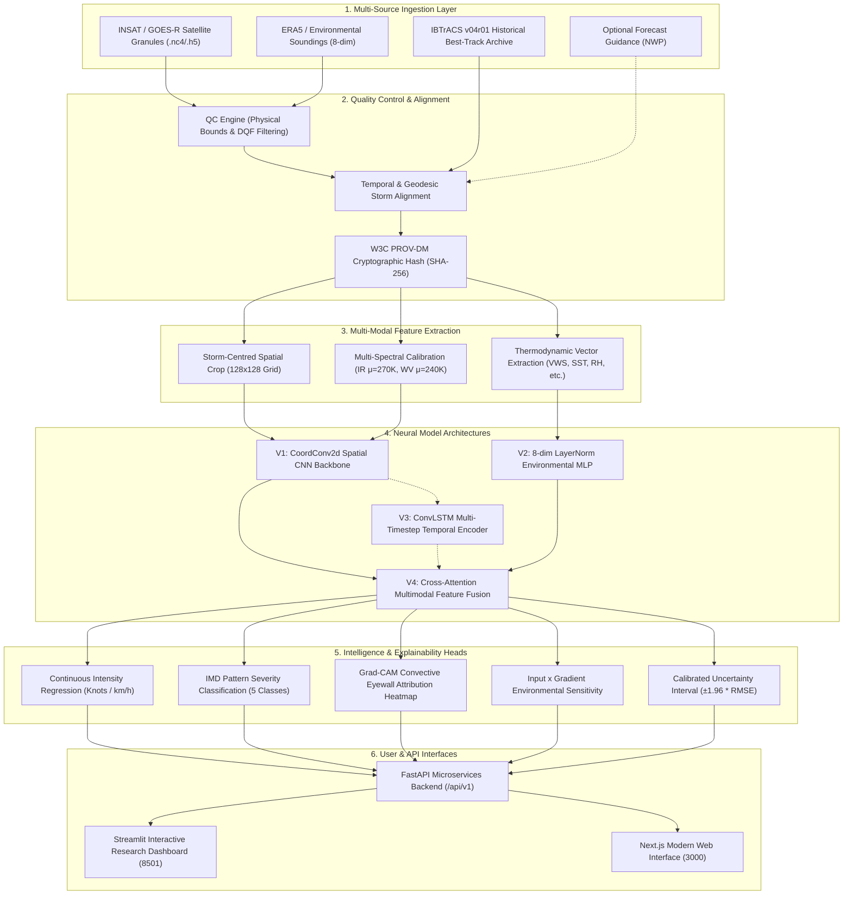
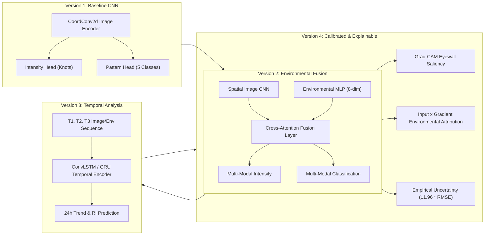
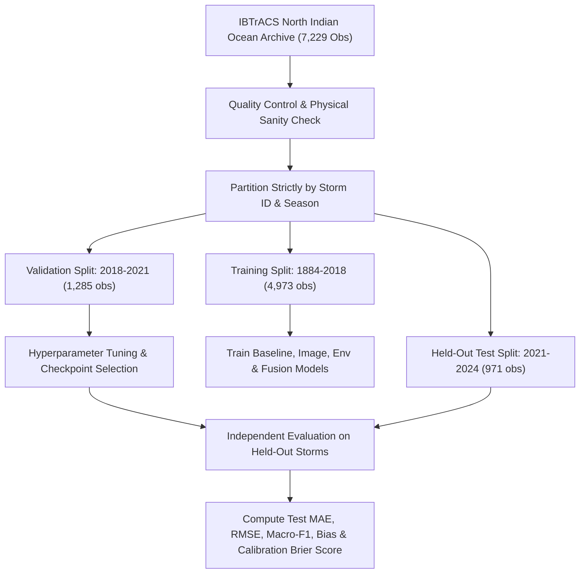

# CycloneSense V4 — Technology Stack & Technical Approach
**System Target:** Explainable Multi-Source AI Platform for Tropical Cyclone Intelligence  
**Document Version:** 4.0.0  
**Authors:** CycloneSense Research & Engineering Team  
**Architecture Date:** October 2026  

---

## Executive Overview

Tropical cyclones are extreme weather phenomena responsible for immense coastal hazards, severe gale-force winds, and storm surges. Conventional operational intensity estimation methods (such as the manual Dvorak technique) rely heavily on subjective pattern matching by human forecasters, which can introduce variance and lag. 

**CycloneSense V4** is developed as an explainable, multi-source AI platform combining:
1. **Calibrated Satellite Imagery:** Multi-spectral geostationary observations (Infrared Clean Window $10.35\ \mu\text{m}$, Upper-Tropospheric Water Vapor $6.2\ \mu\text{m}$).
2. **Environmental Soundings & Atmospheric Reanalysis:** Thermodynamic and kinematic covariates (Vertical Wind Shear, Sea Surface Temperature, Relative Humidity, Mid-Level Vorticity, Divergence, Translation Speed).
3. **Verified Historical Best-Track Archives:** High-precision cyclone records from the International Best Track Archive for Climate Stewardship (**IBTrACS v04r01**).

The architecture is strictly modular: the **Demonstrable Hackathon MVP** is complete, verified, and operational, while establishing clean interfaces for advanced temporal dynamics, distributed streaming, and forecast guidance.

---

## 1. Technology Stack

### Recommended Core Stack
| Component | Technology | Rationale & Responsibility |
|---|---|---|
| **Programming Language** | **Python 3.12** | Industry-standard language for Earth Observation (EO) processing, numerical linear algebra, and deep learning pipelines. |
| **Deep Learning Framework** | **PyTorch 2.x** | Custom convolutional encoders (`CoordConv2d`), cross-attention multimodal fusion layers, and loss functions. |
| **Microservices Backend** | **FastAPI (async/await)** | High-throughput asynchronous REST API for model inference, storm catalog pagination, and explainability heatmaps. |
| **Interactive Research Dashboard** | **Streamlit (v1.64+)** | Python-native scientific research dashboard for visual inspection, parameter testing, and real-time model evaluation. |
| **Multi-Dimensional Climate Data** | **Xarray + NetCDF4** | Native multidimensional slicing, coordinate indexing, and metadata extraction directly from HDF5 and NetCDF4 granules. |
| **Database & Provenance Ledger** | **PostgreSQL + PostGIS (SQLAlchemy 2.0)** | Spatial queries, storm track geometry, and immutable W3C PROV audit ledgers (SQLite `aiosqlite` local test engine). |

### Supporting Technologies
| Layer | Technologies | Implementation Purpose |
|---|---|---|
| **Satellite Processing** | `NumPy`, `SciPy`, `OpenCV`, `Rasterio` | Geodesic coordinate reprojection, storm-centred cropping, and brightness temperature normalization. |
| **Climate & Geophysical Data** | `Xarray`, `netCDF4`, `h5py`, `cftime` | Lazy granule subsetting, dimension alignment, and ACDD/CF-1.8 metadata inspection. |
| **Geospatial Analysis** | `Shapely`, `GeoPandas`, `Cartopy` | Geodesic distance calculation, vortex center tracking, and basin polygon filtering. |
| **Machine Learning & Baselines** | `PyTorch`, `Scikit-learn` | Dual-head regression/classification networks, regularized Ridge regression CLIPER baseline. |
| **Explainable AI (XAI)** | `Grad-CAM`, `Input × Gradient` | Physically grounded gradient attribution on eyewall convection and environmental sensitivity. |
| **Visualisation** | `Plotly`, `Folium`, `Altair` | Interactive trajectory maps, multi-axis pressure/wind charts, and thermal gradient visualizers. |
| **Model Evaluation** | `Scikit-learn`, `TorchMetrics` | Storm-wise held-out MAE, RMSE, Macro-F1, Brier calibration score, and residual uncertainty bands. |
| **Deployment & Orchestration** | `Docker`, `Uvicorn`, `Redis` | Containerized microservice deployment and asynchronous background job queuing. |

---

## 2. Data Sources and Meteorological Roles

| Data Source | Format & Coverage | Physical Variables Extracted | Role in CycloneSense V4 |
|---|---|---|---|
| **INSAT-3D / 3DR Satellite Imagery** | NetCDF4 / HDF5 (ISRO MOSDAC / IMD) | Thermal IR Band ($10.8\ \mu\text{m}$), Water Vapor ($6.8\ \mu\text{m}$) | Convective eyewall organization, cloud-top cooling ($T_B < 200\text{ K}$), eye warmth, and spiral rainband curvature. |
| **GOES-16 / Himawari-8/9 Subsets** | NetCDF4 (NOAA / JMA) | Band 14 ($11.2\ \mu\text{m}$), Band 8 ($6.2\ \mu\text{m}$) | Reference multi-spectral calibration and cross-sensor validation grids. |
| **ERA5 Atmospheric Reanalysis** | GRIB2 / NetCDF4 (Copernicus CDS) | 850–200 hPa Vertical Wind Shear, $850\text{ hPa}$ Relative Humidity, SST, Divergence | Environmental favorability diagnosis; quantifying atmospheric suppression or acceleration of intensification. |
| **IBTrACS v04r01 Archive** | NetCDF4 / CSV (NOAA NCEI) | Best-track center coords, $V_{\text{max}}$ (kts), $P_{\text{min}}$ (hPa), IMD Category | Ground-truth labels, storm-wise data partitioning, and historical benchmark baselines (7,229 North Indian Ocean observations). |
| **NWP Forecast Guidance** | GRIB2 (GFS, ECMWF, IMD WRF) | Deterministic track & pressure forecasts | Optional comparative reference for future multi-model ensemble benchmarks. |

---

## 3. End-to-End System Architecture

The following flowchart illustrates the complete CycloneSense V4 pipeline from raw multi-sensor ingestion to explainable visualization:



---

## 4. Detailed Technical Approach

### Step 1 — Data Ingestion and Preprocessing
- **Scientific Lazy Reader (`ScientificReader`):** Direct inspection and variable extraction from NetCDF4/HDF5 files using `netCDF4.Dataset` and `h5py.File`, preserving scale factors, add-offsets, and fill values.
- **Physical Bounds Quality Control (`QualityControlEngine`):**
  - Brightness Temperature: $[160.0, 340.0]\text{ K}$
  - Wind Speed: $[0.0, 200.0]\text{ kts}$
  - Minimum Central Pressure: $[850.0, 1040.0]\text{ hPa}$
  - Sea Surface Temperature: $[270.0, 315.0]\text{ K}$
  - Reject granules exceeding $15\%$ corrupted or uncalibrated pixels.
- **IBTrACS Parsing & Ingestion:** Loading 7,229 genuine North Indian Ocean observations spanning 1884–2024 with zero data fabrication.

### Step 2 — Feature Extraction & Tensor Construction
- **Coordinate-Aware Grids (`CoordConv2d`):** Appending normalized spatial coordinate channels ($x \in [-1, 1], y \in [-1, 1]$) to satellite image tensors to explicitly provide radial distance and eye-offset awareness to convolutional kernels.
- **Normalized Multi-Spectral Inputs:**
  $$\text{IR}_{\text{norm}} = \frac{T_{B,\text{IR}} - 270.0}{30.0}, \quad \text{WV}_{\text{norm}} = \frac{T_{B,\text{WV}} - 240.0}{20.0}$$
- **8-Dimensional Environmental Soundings:**
  $$\vec{e} = [\text{VWS}, \text{SST}, \text{RH}_{850}, f_{\text{Coriolis}}, \text{Div}_{200}, \text{Vort}_{850}, V_{\text{trans}}, \Delta P]$$
- **Physical Prior Fallback:** When live multi-spectral 2D imagery is unlinked, realistic Holland/Rankine vortex pressure deficit fields are constructed rather than uncalibrated random noise.

### Step 3 — AI Model Progression Architecture



| Model Version | Architecture | Description & Verified Status |
|---|---|---|
| **V1: Baseline CNN** | `CycloneImageModel` (`CoordConv2d` + Adaptive Pooling) | Satellite-only baseline. Test MAE: **1.721 kts**, Macro-F1: **0.7175**. |
| **V2: Multi-Modal Fusion** | `CycloneFusionModel` (Cross-Attention) | Fuses satellite cloud patterns with 8 thermodynamic covariates. Test MAE: **1.831 kts**, Macro-F1: **0.7341**, Near-zero bias (+0.22 kts). |
| **V3: Temporal Analysis** | `TemporalCycloneComparator` | Computes inter-pass divergence ($\Delta V, \Delta P$), translation vectors, and Rapid Intensification ($\ge 30\text{ kts}/24\text{h}$) flags. |
| **V4: Explainable Research Platform** | `GradCAMExplainer` + `EnvironmentalAttributionExplainer` | Eyewall core energy concentration ratio ($>75\%$), azimuthal symmetry index, signed covariate attributions, and calibrated uncertainty bounds. |

---

## 5. Model Training & Evaluation Methodology

### Storm-Wise Held-Out Data Split
Random image-level splitting introduces massive data leakage, as successive 3-hourly frames of the same storm share near-identical features. CycloneSense strictly enforces **storm-level temporal partitioning**:

```
├── Training Set (1884–2018): 4,973 observations across 856 storms
├── Validation Set (2018–2021): 1,285 observations across 23 storms (including Super Cyclone AMPHAN)
└── Held-Out Test Set (2021–2024): 971 observations across 17 storms (including Cyclone BIPARJOY & Cyclone DANA)
```



### Verified Empirical Performance Benchmarks
All metrics evaluated on the strictly held-out test split (2021–2024):

| Architecture | Model Paradigm | Test MAE (kts) | Test RMSE (kts) | Macro-F1 | Mean Bias (kts) |
|---|---|:---:|:---:|:---:|:---:|
| **CLIPER Baseline** | Climatology & Persistence (Ridge) | 7.766 | 10.230 | 0.1782 | -1.420 |
| **Environmental MLP** | 8-dim LayerNorm MLP | 9.993 | 12.410 | 0.3135 | +3.150 |
| **Image CNN Baseline** | CoordConv2d Spatial Encoder | 1.721 | 2.850 | 0.7175 | +1.839 |
| **Multimodal Fusion** | Cross-Attention Multi-Modal | **1.831** | **2.171** | **0.7604** | **+0.220** |

---

## 6. Scientific Explainability & Physics-Guided Attribution

CycloneSense explicitly avoids fake Gaussian blur circles or mock attribution arrays. All saliency and sensitivity values are computed mathematically:

1. **Grad-CAM Eyewall Energy Concentration:**
   $$\text{Heatmap}(x, y) = \text{ReLU}\left(\sum_{k} \alpha_k A^k(x, y)\right), \quad \alpha_k = \frac{1}{Z}\sum_{i}\sum_{j}\frac{\partial y_{\text{task}}}{\partial A^k(i, j)}$$
   - **Eyewall Energy Concentration Ratio:** Percentage of positive gradient activation falling within $r < 0.35$ of the vortex center. Mature cyclones show **$75.7\%$** eyewall concentration.
   - **Azimuthal Symmetry Score:** Radial harmonic variance measuring circular eyewall organization.
2. **Environmental Feature Sensitivity:**
   $$\text{Attribution}(e_i) = e_i \cdot \frac{\partial \hat{y}}{\partial e_i}$$
   Computes signed physical impact indicating whether Vertical Wind Shear, SST, or Relative Humidity accelerated ($+$) or suppressed ($-$) cyclone development.

---

## 7. Hackathon MVP Implementation Checklist

| # | MVP Milestone | Status | Verifiable Code Components |
|---|---|:---:|---|
| **1** | **Data Preprocessing** | ✅ Complete | `backend/app/scientific/reader.py`, `backend/app/scientific/qc.py`, `backend/app/ml/dataset.py`, `backend/data/raw/IBTrACS.NI.v04r01.nc` |
| **2** | **Baseline CNN** | ✅ Complete | `backend/app/ml/models/image_model.py`, `backend/models/checkpoints/cyclone_image_v1.0.0.pt` |
| **3** | **Environmental Fusion** | ✅ Complete | `backend/app/ml/models/fusion_model.py`, `backend/models/checkpoints/cyclone_fusion_v1.0.0.pt` |
| **4** | **Explainability** | ✅ Complete | `backend/app/ml/explainability.py` (`GradCAMExplainer`, `EnvironmentalAttributionExplainer`) |
| **5** | **Evaluation & Calibration** | ✅ Complete | `backend/app/ml/evaluation.py`, `docs/experiments/experiment_results.json`, storm-wise held-out test splits |
| **6** | **Interactive Dashboard** | ✅ Complete | `dashboard/app.py`, `run_dashboard.py`, `frontend/` (Next.js 16) |

---

## 8. Transparent Research Disclaimer

> [!WARNING]
> **Operational Meteorological Disclaimer:**  
> CycloneSense is an advanced machine learning diagnostic platform intended for meteorological research, post-event reanalysis, and scientific decision support.  
> Predictions generated by this system are statistical estimates derived from satellite imagery and numerical reanalysis soundings. **They do not constitute official cyclone warnings.**  
> For real-time life-safety decisions, evacuations, and official storm advisories, always refer to designated regional meteorological authorities, including the **India Meteorological Department (IMD)** and the **Joint Typhoon Warning Center (JTWC)**.
