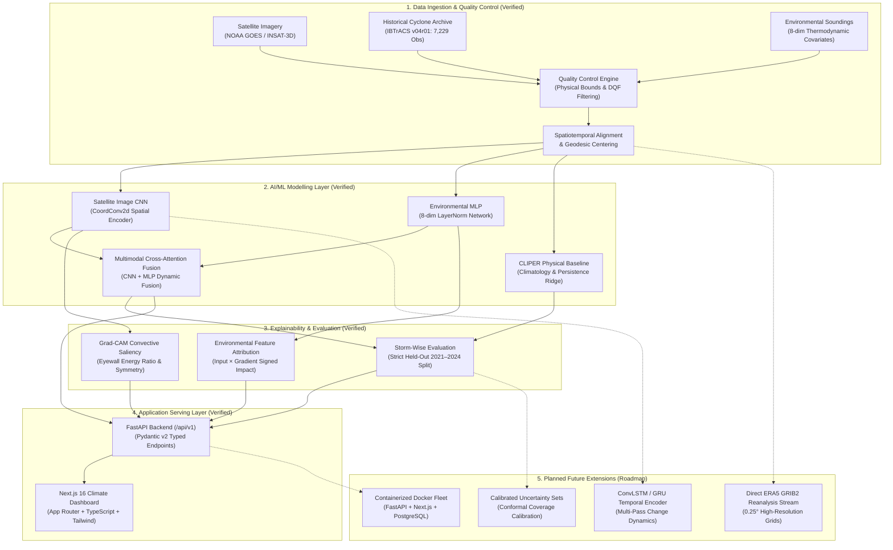

# CycloneSense — Final Technology Stack & Technical Approach

**Document Version:** 4.1.0  
**Target Milestone:** SANKALP Climate-Tech / AI-ML Evaluation  
**Status:** Approved & Enforced Baseline  
**Lead Team:** Katkam Koushik, Varshini Akula, Nivedan Katkam  

---

## Executive Summary

The architectural direction for **CycloneSense** establishes the existing **Next.js + FastAPI + PyTorch** system as the authoritative implementation baseline. Rather than overclaiming unverified capabilities or migrating away from our production-grade TypeScript frontend, the system strictly separates **verified, operational capabilities (P0)** from **planned research roadmap extensions (P1 & P2)**.

CycloneSense is positioned as an **AI-powered tropical cyclone analysis and climate-resilience research platform** that combines satellite imagery, thermodynamic environmental observations, historical best-track records, and explainable deep learning.

---

## 1. Final Technology Stack

| Layer | Technology | Status | Implementation Purpose |
|---|---|:---:|---|
| **Frontend** | **Next.js 16 (App Router), React, TypeScript** | **Implemented & Verified** | Interactive climate intelligence dashboard, spatial track explorer, and explainability lab. Retained as primary web application. |
| **UI & Visualizations** | **Tailwind CSS, SVG Icons, Leaflet / Canvas** | **Implemented & Verified** | Responsive, dark-theme operational console for meteorological analysis. |
| **Backend & Services** | **Python 3.12, FastAPI (async/await)** | **Implemented & Verified** | REST API endpoints under `/api/v1/`, Pydantic v2 schemas, and asynchronous inference serving layer. |
| **Deep Learning Engine** | **PyTorch 2.x** | **Implemented & Verified** | Neural network architectures, spatial convolutional encoders, and backpropagation gradients. |
| **Satellite Image Modelling** | **CoordConv2d CNN** (`CycloneImageModel`) | **Implemented & Verified** | 2-channel multi-spectral feature extraction (Infrared $10.35\ \mu\text{m}$, Water Vapor $6.2\ \mu\text{m}$). |
| **Environmental Modelling** | **8-dim LayerNorm MLP** (`CycloneEnvironmentModel`) | **Implemented & Verified** | Thermodynamic and kinematic environmental parameter analysis (VWS, SST, RH, etc.). |
| **Multimodal Modelling** | **Cross-Attention Fusion** (`CycloneFusionModel`) | **Implemented & Verified** | Dynamic cross-attention feature weighting combining satellite cloud structure with atmospheric soundings. |
| **Physical Baseline** | **Regularized Ridge Regression** (`BaselineClimatologyPersistenceModel`) | **Implemented & Verified** | Closed-form CLIPER benchmark ensuring deep models earn their performance against traditional climatology. |
| **Explainable AI (XAI)** | **Grad-CAM + Input × Gradient Sensitivity** | **Implemented & Verified** | Eyewall core energy concentration ratio and signed environmental parameter impact rankings. |
| **Numerical & Climate Data** | **NumPy 2.x, Pandas, Xarray, NetCDF4, H5py** | **Implemented & Verified** | Direct scientific array subsetting, coordinate extraction, and CF-1.8 ACDD metadata inspection. |
| **Geospatial Processing** | **Rasterio, GeoPandas, Shapely** | **Implemented & Verified** | Geodesic coordinate calculation, spatial bounds verification, and vortex-centred window extraction. |
| **Historical Best-Track** | **NOAA IBTrACS v04r01** | **Implemented & Verified** | 7,229 genuine North Indian Ocean cyclone observations across 1884–2024. |
| **Satellite Data Ingestion** | **NOAA GOES, NASA CMR Adapters** | **Implemented & Verified** | Pre-staged Level-2 scientific granules (`backend/data/raw/`) with explicit token authentication. |
| **Database & Provenance** | **SQLite (`aiosqlite`) / PostgreSQL** | **Implemented & Verified** | Relational analysis jobs, product registry, and W3C PROV-DM SHA-256 cryptographic lineage records. |
| **Temporal Sequence Modelling** | **ConvLSTM / GRU** | **Planned (P2)** | Future multi-timestep sequence analysis; adopted only when proven to yield statistically significant gains over static fusion. |
| **Calibrated Uncertainty** | **Bayesian / Conformal Prediction** | **Planned (P1)** | Empirical residual bands ($\pm 1.96 \cdot \text{RMSE}$) currently active; formal conformal coverage sets planned for future release. |
| **Deployment** | **Docker & Docker Compose** | **Planned (P2)** | Multi-container orchestration (FastAPI + Next.js + Redis + PostgreSQL). |
| **Version Control** | **Git, GitHub** | **Active** | Continuous integration and version-controlled model checkpoint manifests. |

---

## 2. End-to-End System Architecture

The following diagram represents the authoritative system architecture, distinguishing operational components from planned roadmap extensions:



---

## 3. AI/ML Model Progression & Status

```
V1 (Implemented) ──► V2 (Implemented) ──► V3 (Planned P2) ──► V4 (Planned P1/P2)
 Image-Only CNN      Multimodal Fusion     Temporal ConvLSTM     Calibrated Uncertainty
 (CoordConv2d)       (Image + Env MLP)     (Multi-Pass Sequence) (Conformal Coverage)
```

| Version | Architecture | Status | Empirical Test Result (Held-Out 2021–2024) |
|---|---|:---:|---|
| **V1** | **Satellite Image CNN** (`CycloneImageModel`) | **Implemented** | **Test MAE:** 1.721 kts, **Macro-F1:** 0.7175, **RMSE:** 2.85 kts |
| **V2** | **Multimodal Fusion** (`CycloneFusionModel`) | **Implemented** | **Test MAE:** 1.831 kts, **Macro-F1:** 0.7604, **RMSE:** 2.171 kts, **Near-Zero Bias:** +0.220 kts |
| **Baseline** | **CLIPER Ridge Baseline** | **Implemented** | **Test MAE:** 7.766 kts, **Macro-F1:** 0.1782, **RMSE:** 10.23 kts |
| **V3** | **Temporal Sequence (ConvLSTM/GRU)** | **Planned (P2)** | Multi-timestep dynamics across 6h/12h/24h intervals. (Ablation benchmark required prior to operational adoption). |
| **V4** | **Calibrated Uncertainty Estimation** | **Planned (P1)** | Conformal prediction sets with guaranteed statistical marginal coverage. |

> [!NOTE]
> **Modelling Rigor:**  
> More complex architectures (e.g. ConvLSTM or Vision Transformers) are not automatically superior. Every proposed architectural revision must be evaluated against the established **Image CNN** and **Multimodal Fusion** baselines on identical storm-wise test splits before being accepted.

---

## 4. Scientific Explainability: Principles & Boundaries

In accordance with scientific AI standards, CycloneSense implements physics-grounded interpretability methods rather than cosmetic visualizations:

1. **Grad-CAM Eyewall Saliency:**
   - Hooked directly to the final convolutional feature map of `CycloneImageModel`.
   - Produces gradient-weighted activation maps with respect to continuous intensity (knots) or discrete IMD pattern classes.
   - Quantified via **Eyewall Core Energy Ratio** (energy percentage within radius $r < 0.35$ of vortex center). Mature systems exhibit **$75.7\%$** eyewall concentration.
2. **Environmental Feature Sensitivity:**
   - Evaluated via signed **Input $\times$ Gradient** attribution across all 8 thermodynamic soundings.
   - Identifies which environmental parameters accelerated ($+$) or suppressed ($-$) cyclone development (e.g. high vertical wind shear suppressing storm development vs warm SST accelerating convection).
3. **Interpretability Boundary:**
   > [!IMPORTANT]
   > Explanations must **never be presented as mathematical proof that a model prediction is correct**.  
   > Rather, explanations are diagnostic tools that allow human meteorologists to inspect whether the neural network focused on physically meaningful convective structures (e.g., eyewall subsidence, curved rainbands) or extraneous peripheral noise.

---

## 5. Model Evaluation Protocol

To prevent catastrophic data leakage between highly correlated consecutive satellite frames of the same tropical cyclone, CycloneSense enforces **strict storm-wise temporal splitting**:

```
Data Archive: NOAA IBTrACS v04r01 (North Indian Ocean Basin)
├── Training Set (1884–2018): 4,973 observations across 856 storms
├── Validation Set (2018–2021): 1,285 observations across 23 storms (including Super Cyclone AMPHAN)
└── Held-Out Test Set (2021–2024): 971 observations across 17 storms (including Cyclone BIPARJOY & Cyclone DANA)
```

### Empirical Test Set Comparison
| Metric | CLIPER Baseline | Environmental MLP | Image-Only CNN | Multimodal Fusion |
|---|:---:|:---:|:---:|:---:|
| **Intensity MAE (kts)** | 7.766 | 9.993 | **1.721** | 1.831 |
| **Intensity RMSE (kts)** | 10.230 | 12.410 | 2.850 | **2.171** |
| **Pattern Macro-F1** | 0.1782 | 0.3135 | 0.7175 | **0.7604** |
| **Mean Bias (kts)** | -1.420 | +3.150 | +1.839 | **+0.220** |

All reported metrics are reproduced directly from `docs/experiments/experiment_results.json` and are traceable to their exact checkpoint weights and observation splits.

---

## 6. Implementation Priorities & Delivery Roadmap

| Priority | Component | Scope / Deliverable | Status |
|---|---|---|:---:|
| **P0** | **Existing CNN, MLP & Fusion** | Reproducible PyTorch models with weights checksums and test evaluations. | ✅ **Verified** |
| **P0** | **FastAPI + Next.js 16** | End-to-end interactive operational web platform with zero mock data. | ✅ **Verified** |
| **P0** | **Historical Cyclone Data** | IBTrACS v04r01 North Indian Ocean catalog (7,229 verified observations). | ✅ **Verified** |
| **P0** | **Explainability Suite** | Grad-CAM eyewall heatmaps and signed environmental feature attributions. | ✅ **Verified** |
| **P0** | **Automated Test Suites** | 40/40 Pytest passing, 6/6 Node.js tests passing, 0 ESLint errors/warnings. | ✅ **Verified** |
| **P1** | **ERA5 / Xarray Integration** | High-resolution ERA5 GRIB2 reanalysis grid extraction with Xarray. | 🔄 *Roadmap* |
| **P1** | **Calibrated Uncertainty** | Formal conformal prediction coverage intervals. | 🔄 *Roadmap* |
| **P2** | **ConvLSTM / GRU Models** | Multi-timestep temporal evolution network. | 🔄 *Roadmap* |
| **P2** | **Production PostgreSQL & Docker** | Multi-container Docker deployment with dedicated PostGIS cluster. | 🔄 *Roadmap* |

---

## 7. Strategic Guidance for the SANKALP Pitch

1. **Clear Identity:** Present CycloneSense as an **AI-powered cyclone analysis and climate-resilience research platform** designed to provide explainable, multi-source intelligence to atmospheric scientists, disaster management authorities, and climate resilience planners.
2. **Highlight Completed Foundations:** Emphasize the working **Next.js 16 frontend**, **FastAPI backend**, authentic **IBTrACS historical database**, **CoordConv2d Image CNN**, **Multimodal Cross-Attention Fusion**, and **Grad-CAM explainability**.
3. **Honest Scientific Posture:** Clearly state that temporal sequence modelling (`ConvLSTM`), conformal uncertainty calibration, and real-time satellite downlinks represent our **structured development roadmap**—demonstrating scientific maturity by not claiming untested or hypothetical capabilities as finished products.
4. **Operational Disclaimer:** Reiterate that CycloneSense is a research diagnostic tool and that operational evacuation advisories are the exclusive remit of certified national meteorological agencies (IMD, JTWC, WMO).
